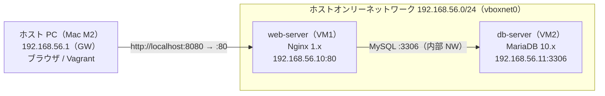

# virtualbox-network-lab

[](https://github.com/asiankungfu/virtualbox-network-lab/actions/workflows/ci.yml)


VirtualBox + Vagrant による **Web サーバー（Nginx）/ DB サーバー（MariaDB）2 台構成**の仮想ネットワーク環境です。VM 構成を `Vagrantfile` でコード化（IaC）し、`vagrant up` 1 コマンドで再現可能な環境を構築します。インフラ SE・SRE を志すためのポートフォリオを目的としています。

---

## ネットワーク構成



通信フロー：`ホスト PC → [ホストオンリー NW] → web-server:80 → [内部 NW] → db-server:3306`

| コンポーネント | 役割 | IP アドレス | ポート |
|---|---|---|---|
| web-server（VM1） | Nginx Web サーバー | 192.168.56.10 | 80（HTTP） |
| db-server（VM2） | MariaDB DB サーバー | 192.168.56.11 | 3306（MySQL） |
| ホスト PC（Mac M2） | Vagrant 実行 / ブラウザ | 192.168.56.1（GW） | — |

---

## ディレクトリ構成

```
virtualbox-network-lab/
├── Vagrantfile            # VM 定義・ネットワーク・プロビジョニング指定
├── provision/
│   ├── common.sh          # 共通パッケージ更新処理
│   ├── web.sh             # Nginx インストール・設定
│   └── db.sh              # MariaDB インストール・初期化
├── config/
│   ├── nginx.conf         # Nginx 設定テンプレート
│   └── mariadb.cnf        # MariaDB 設定ファイル
├── .env.example           # パスワード設定の雛形（.env はコミットしない）
├── .gitignore
├── LICENSE                # MIT
└── README.md
```

---

## 前提条件

- [VirtualBox](https://www.virtualbox.org/)（7.x 推奨）
- [Vagrant](https://www.vagrantup.com/)（2.x）
- macOS（Apple Silicon の場合は Rosetta / 互換環境が必要）または Windows

> **Apple Silicon (M1/M2/M3) について**: VirtualBox は x86 仮想化が前提のため、Apple Silicon 上では動作が限定的です。動かない場合は Intel Mac / Windows、または Parallels・UTM・QEMU 等の代替を検討してください。

---

## セットアップ手順

```bash
# 1. リポジトリを取得
git clone https://github.com/asiankungfu/virtualbox-network-lab.git
cd virtualbox-network-lab

# 2. パスワードを設定（いずれか）
#    a) .env ファイルで管理（推奨）
cp .env.example .env && vi .env       # DB_ROOT_PASS / DB_APP_PASS を編集
#    b) または環境変数で
export DB_ROOT_PASS="your_strong_password"

# 3. 環境構築（2VM の起動 + プロビジョニング）
vagrant up

# 4. 状態確認
vagrant status
```

---

## 動作確認

| 手順 | コマンド / 確認内容 | 期待結果 |
|---|---|---|
| 1 | `vagrant up` | 2 VM が正常起動（エラーなし） |
| 2 | `vagrant status` | web-server / db-server が **running** |
| 3 | ブラウザで http://localhost:8080 | Nginx ページが表示される |
| 4 | `vagrant ssh web-server -c "curl -s http://192.168.56.10"` | HTML が返却される |
| 5 | `vagrant ssh web-server -c "mysql -h 192.168.56.11 -u appuser -p"` | MariaDB に接続成功 |
| 6 | `vagrant halt && vagrant up` | 再起動後も同一動作（冪等性確認） |

---

## VM 仕様

| 項目 | web-server | db-server |
|---|---|---|
| Base Box | ubuntu/jammy64（22.04 LTS） | ubuntu/jammy64（22.04 LTS） |
| vCPU | 1 コア | 1 コア |
| メモリ | 1024 MB | 1024 MB |
| ホストオンリー IP | 192.168.56.10 | 192.168.56.11 |
| ポートフォワード | 8080 → 80 | なし |
| ミドルウェア | Nginx 1.x | MariaDB 10.x |

---

## 設定値（Vagrantfile 冒頭で一括管理）

| 変数名 | 値 | 説明 |
|---|---|---|
| `WEB_IP` | 192.168.56.10 | Web サーバーの IP |
| `DB_IP` | 192.168.56.11 | DB サーバーの IP |
| `WEB_MEM` / `DB_MEM` | 1024 | メモリ（MB） |
| `BOX_NAME` | ubuntu/jammy64 | 使用 Box |
| `DB_ROOT_PASS` | 環境変数 `DB_ROOT_PASS` | MariaDB root パスワード |

---

## トラブルシューティング

| 症状 | 原因 / 対処 |
|---|---|
| `vagrant up` でネットワークエラー | VirtualBox の `/etc/vbox/networks.conf` で `192.168.56.0/24` を許可する |
| http://localhost:8080 が表示されない | `vagrant ssh web-server -c "systemctl status nginx"` で Nginx 状態を確認 |
| web から DB に接続できない | UFW（3306）と MariaDB の `bind-address=0.0.0.0`、ユーザー権限を確認 |
| Apple Silicon で起動しない | VirtualBox は x86 前提。Intel 環境または代替仮想化を使用 |
| プロビジョニングを再実行したい | `vagrant provision` を実行（スクリプトは冪等） |

---

## 運用コマンド

```bash
vagrant halt          # VM 停止
vagrant provision     # プロビジョニング再実行（冪等）
vagrant reload        # 再起動（設定再読込）
vagrant destroy -f    # VM 破棄
```

---

## GitHub 管理方針

- リポジトリ名: `virtualbox-network-lab`（パブリック）
- ブランチ戦略: `main`（安定版）/ `feature/*`（機能追加）
- コミットメッセージ: `feat` / `fix` / `docs` / `chore` プレフィックス
- `.vagrant/` `.env` は `.gitignore` で除外

```bash
# 初回 push 例
git init -b main
git add .
git commit -m "feat: VirtualBox 2VM network lab (Nginx + MariaDB)"
git remote add origin https://github.com/asiankungfu/virtualbox-network-lab.git
git push -u origin main
```

---

## ライセンス

MIT License（[LICENSE](LICENSE) 参照）

作成者: 加茂釉芭 / v1.0（2026 年 6 月）
